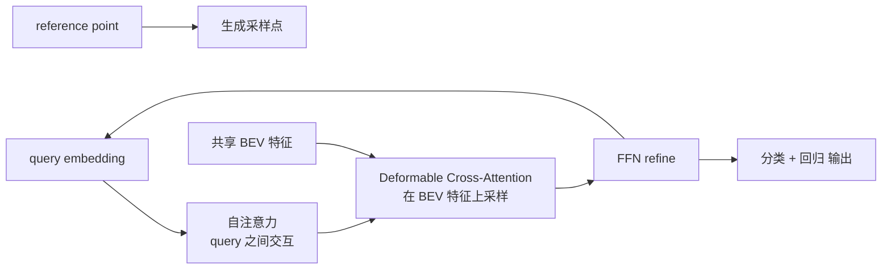
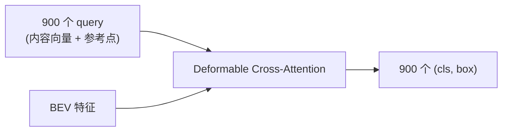
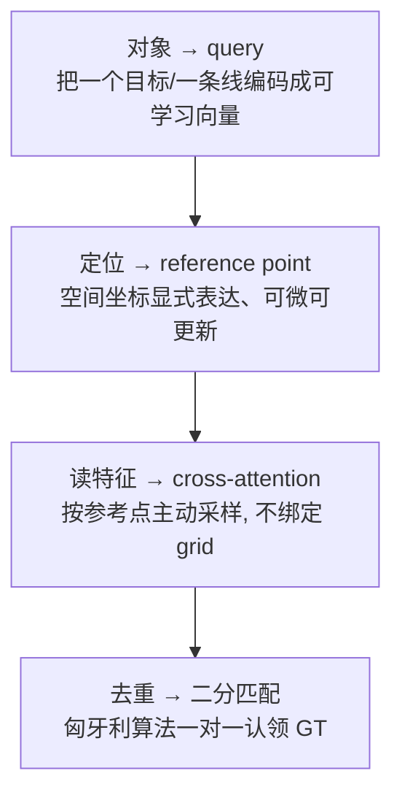
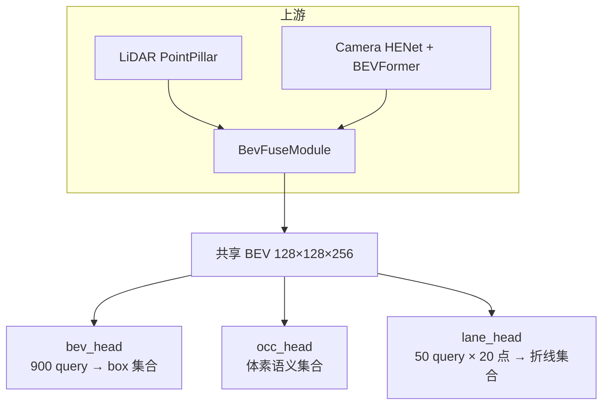
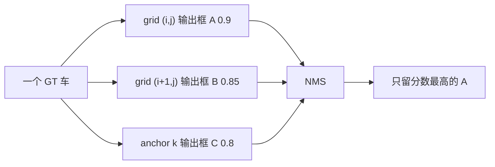
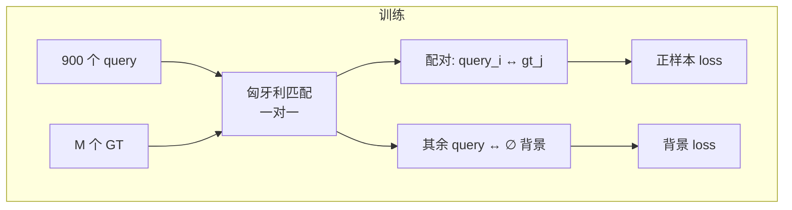
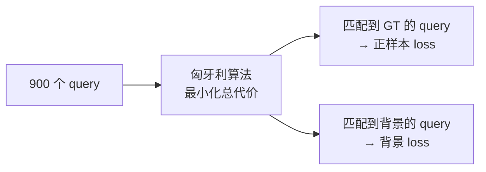
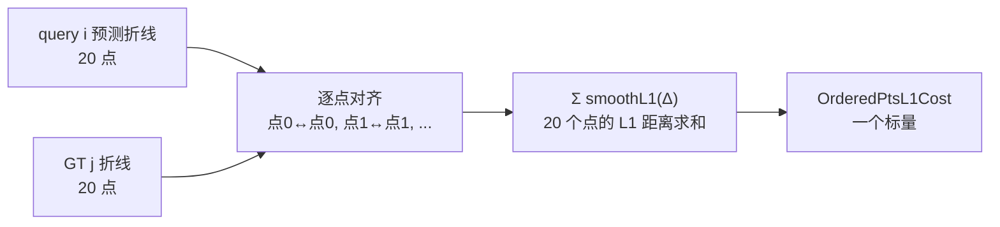

# DETR Query 原理专题

> 一个面向初学者的学习专题，讲清楚 DETR query 的本质、密集预测与集合预测的区别、为什么它能支持多任务，以及匈牙利匹配如何取代 NMS。
>
> 本文以 `BevFusion`（`bevfusion_pointpillar_henet_multisensor_multitask_nuscenes.py`）为具体案例。

---

## 目录

1. [一句话总结](#一句话总结)
2. [DETR query 是什么](#detr-query-是什么)
3. [密集预测 vs 集合预测](#密集预测-vs-集合预测)
4. [抽象是怎么发生的](#抽象是怎么发生的)
5. [为什么各种头都能基于 query 做多任务](#为什么各种头都能基于-query-做多任务)
6. [匈牙利匹配如何取代 NMS](#匈牙利匹配如何取代-nms)
7. [匈牙利匹配的代价矩阵怎么算](#匈牙利匹配的代价矩阵怎么算)
8. [落地对照表](#落地对照表)

---

## 一句话总结

> **DETR query = 一组可学习的"内容向量 + 参考点"，通过 deformable cross-attention 从共享特征里主动拉取信息，把"检测/车道线/占用"统一抽象成"集合预测(set prediction)"。**
>
> 因为所有头都复用"query → 采样 → 输出"这套同构接口，且 query 独立、特征共享，所以加一个任务 = 换一套 query + assigner + loss，backbone 与 BEV 融合保持不变。

---

## DETR query 是什么

一个 DETR query 由两部分组成：

| 组成 | 含义 | 例子 |
|---|---|---|
| **query embedding**（内容向量） | 可学习/可更新的隐状态，编码"这个 query 在找什么" | `num_query=900` 个 256 维向量 |
| **reference point**（参考点） | 一个空间坐标，告诉模型"该去哪里看" | 检测头在 BEV 上、lane 头在折线的 20 个采样点 |

推理流程固定为四步，循环 `num_layers` 次：



关键点：**query 通过 cross-attention 从 BEV 特征里"主动拉取"信息**，而不是像 CNN 那样把整张图都卷积一遍。每个 query 只关心自己 reference point 附近的东西。

---

## 密集预测 vs 集合预测

### 密集预测 (dense prediction)

输出在**固定网格**上，每个网格单元预测一个固定结果。输出张量形状和输入空间尺寸**绑定**。


**特征**：
- 输出维度 = 空间分辨率 × 类别数，是**固定的张量**。
- 每个位置独立、无对象概念。一条车道线会被拆成几十个格子分别预测，之后还要靠后处理把它们"拼"回来。
- 分类和定位是**同一件事**（每个格子"属于哪一类"），无法显式表达"这是一整条线"。

### 集合预测 (set prediction)

输出是**长度可变的集合**，每个元素是一个"对象"，张量形状和空间尺寸**解耦**，只和"最多有多少个对象"有关。



**特征**：
- 输出是一个**集合**，每个元素 = 一个对象（一个 box / 一条折线）。
- 分类和定位**分离**：每个 query 同时输出"是什么"（cls）和"在哪"（box/points）。
- 对象是整体，一条车道线 = 一个 query = 20 个点，不会再被拆散。

### 对照表

| 维度 | 密集预测 | 集合预测 |
|---|---|---|
| 输出单元 | 像素/体素 | query（900 / 50 个） |
| 输出形状 | 随空间分辨率变化 | 只随 query 数变化 |
| 对象概念 | 无，逐格预测 | 有，每 query 一个对象 |
| 分类 vs 定位 | 合一（每格一个类） | 分离（cls + box/points） |
| 匹配 GT | 无（逐格算 loss） | 匈牙利二分匹配 |
| 去重 | NMS（推理阶段、模型输出之后，不可微、不参与训练） | 匈牙利匹配（训练阶段、算 loss 之前，匹配本身不可微，但为可微 loss 分配标签） |

---

## 抽象是怎么发生的

关键在于 **query 这个中介**，它把"从特征里取答案"这件事从**按位置遍历**改成了**按对象去取**。

### 密集预测的取法：被动、按位置

卷积/FCN 的输出位置是**硬件写死的**——第 (i,j) 个输出单元，永远对应感受野里的第 (i,j) 块区域。模型"看哪里"由网络结构决定，你不能指定。

### 集合预测的取法：主动、按对象

每个 query 带一个 **reference point**，明确指定"我要去 BEV 的哪个位置采样"：

```
query_0  → reference point (30.2, -12.5)  → 在 BEV 这个位置附近采样
query_1  → reference point (-8.1, 40.0)   → 在另一个位置采样
```

Cross-attention 就是让 query **主动去它想去的地方**读特征：

$$\text{query}_{new} = \text{Attention}(\text{query},\ \text{BEV at reference points})$$

### 抽象的四步



> 密集预测里，"一个对象 = 多个格子投票"；集合预测里，"一个对象 = 一个 query 整体预测"。这就是"抽象"的核心差异。

---

## 为什么各种头都能基于 query 做多任务

### 原因一：接口统一 = 集合预测

DETR 把输出定义为**一个长度可变的集合**：`{ (类别, 几何) × N }`。这个抽象极其通用：

| 任务 | query 代表什么 | 输出的"几何" | reference point |
|---|---|---|---|
| 3D 检测 | 一个目标 | box（center/size/yaw/vel） | box 中心 + 4 个采样点 |
| 车道线 (lane) | 一条线 | 20 个有序点 | 折线上 20 个点 |
| 占用 (occ) | 一个 voxel 语义 | 类别标签 | 体素中心 |

三者输出结构不同，但**"query → 采样 → 输出"的骨架完全相同**，共享同一个 BEV 特征就能并行工作。

### 原因二：query 是"可微的路由"，天然解耦

- 每个头的 query 是**独立初始化**的，一个头学到的 query 不会干扰另一个头（互不共享参数）。
- 它们都只读同一个 BEV 特征，通过不同 reference point 去不同地方采样，**不需要修改上游网络**。
- 因此"多任务"退化成简单动作：`bev_decoders = [bev_head, occ_head, lane_head]`。

### 原因三：二分匹配让集合预测可训练

传统检测需要锚框 + NMS + 手工匹配 GT；DETR 用**匈牙利算法**在 query 和 GT 之间做一对一最优匹配。换任务只换 assigner 和 loss，骨架不变。

### 整体架构



三个头各自持有**独立的 query**，通过 deformable cross-attention 从同一个 BEV 里采样。加 lane head 唯一要做的是：定义 lane 的 query、匹配器、loss、后处理——上游 BEV 融合不动。

### 为什么特别适合多任务融合

1. **显式空间锚定**：query 带着 reference point，能明确表达"这条车道线在 BEV 哪个位置"，不同任务的空间语义对齐到同一坐标系。
2. **统一的可学习对象表征**：检测目标和车道线都被编码成"内容向量"，可在 query 之间做跨任务交互。
3. **稀疏、省算力**：query 数量固定（900/50），推理成本与 BEV 大小解耦，适合 BPU 这类算力受限平台。

---

## 匈牙利匹配如何取代 NMS

### 问题根源：密集预测为什么必须有 NMS

锚框(anchor)让"一个目标"变成"成千上万个候选"：



NMS 是纯后处理，模型本身不知道"去重"这件事。它有三个毛病：
- **IoU 阈值超参敏感**：阈值大了漏删、小了误删重叠的真实目标。
- **不可微**：不参与训练，训练/推理目标不一致。
- **串行、慢**：排序 + 逐框比对，难以并行。

### DETR 的解法：把去重从推理搬到训练



**核心机制**：一个 GT 只能被一个 query 匹配。如果有两个 query 都预测同一个车：
- 匈牙利算法只把其中一个匹配给这个 GT（算正样本）；
- 另一个要么匹配给别的 GT，要么匹配到背景（算背景 loss，被压制）。

于是梯度会**主动惩罚"重复预测同一目标"的 query**，把它们推到背景。训练收敛后，模型学到的策略就是：每个目标恰好有一个 query 负责输出，其余都闭嘴。

### 匈牙利匹配替代了什么

| 环节 | 密集检测（anchor + NMS） | DETR（集合预测 + 匈牙利匹配） |
|---|---|---|
| 谁产生候选 | 网格 × 锚框，成千上万个 | 固定 900 个 query |
| 谁决定"谁算正样本" | IoU 阈值（一个 GT 匹配多个 anchor） | 匈牙利一对一（一个 GT 只匹配一个 query） |
| 去重发生在哪 | 推理后（NMS，硬规则） | 训练中（匹配，可微的 loss） |
| 是否可微 | NMS 不可微，且不参与训练 | 匹配本身不可微（需 detach），但其后的 loss 可微 |
| 推理时 | 仍要跑 NMS | 直接输出，无 NMS |

准确说，**匈牙利匹配替代的是"锚框分配(IoU 匹配) + NMS 去重"这两件事的总和**。

### 为什么 DETR 推理时不需要 NMS

推理时模型直接输出 900 个结果，每个 query 独立给出 `(cls, box)`。因为训练时已被强制"一个目标一个 query"，推理时 900 个 query 天然就是去重后的集合，只需**分数阈值 + top-K**，不需要任何 IoU 比对。

```python
# bev_head 的 post_process —— 没有 NMS
post_process=dict(
    type="BevFormerProcess",
    post_center_range=[-61.2, -61.2, -10.0, 61.2, 61.2, 10.0],
    pc_range=point_cloud_range,
    max_num=300,          # 只取分数最高的 300 个（top-K，不是去重）
    num_classes=10,
),
```

### 一个必须知道的代价

匈牙利匹配的匹配结果是**离散的、不可微的**。DETR 的处理方式：
- 匹配阶段用 `detach()` 断开梯度——匹配结果当作"常量标签"；
- 梯度只通过**被匹配上的 query 的预测值**传播。

这样去重（匹配）由匈牙利算法做（确定性、无梯度），回归/分类精度由普通 loss 做（有梯度、可训练），两者解耦，正是 DETR 能端到端训练的关键。

---

## 匈牙利匹配的代价矩阵怎么算

### 代价矩阵长什么样

$C$ 是一个 $900 \times M$ 的矩阵（900 个 query，M 个 GT），每个元素是"让 query i 认领 GT j 要付多少代价"，越小越般配。

```
             GT_0    GT_1    GT_2   ...  GT_{M-1}   ∅   ∅  ...  ∅
query_0    [ 3.2     8.1     5.7    ...    9.9       b0  b0 ...  b0 ]
query_1    [ 6.5     2.1     7.3    ...    4.8       b1  b1 ...  b1 ]
query_2    [ 9.0     6.6     1.2    ...    8.4       b2  b2 ...  b2 ]
   ...      ...
query_899  [ 5.5     7.7     3.3    ...    2.9       b899 ...  b899]
```

- **行** = query（900 个），**列** = GT（M 个）。
- 因为 query 数 >> GT 数，矩阵右边补上**背景列(∅)**，补成 $900 \times 900$ 方阵。

### 每个格子的公式

$$C[i,j] = 2.0\cdot \underbrace{\text{FocalLossCost}}_{\text{类别对不对}} + 0.25\cdot \underbrace{\text{BBox3DL1Cost}}_{\text{位置准不准}}$$

### 分类代价：FocalLossCost

衡量 query 预测类别与 GT 真实类别的距离，用 focal loss 形式（`alpha=0.25, gamma=2.0`）：

$$\text{cls\_cost}(i,j) = -\alpha\left(1 - p_i[c_j]\right)^\gamma \log p_i[c_j]$$

- $p_i[c_j] \to 1$（query 有把握就是这类）→ 代价 → 0。
- $p_i[c_j] \to 0$（完全不是这类）→ 代价 → ∞。

### 回归代价：BBox3DL1Cost

衡量 query 预测 3D 框与 GT 框的 L1 距离（绝对值求和）：

$$\text{reg\_cost}(i,j) = \sum_k \left| \hat b_i[k] - b_j[k] \right|$$

$k$ 遍历 box 维度（中心点 xyz、尺寸 wlh、朝向 yaw、速度 vx/vy，约 7~9 维）。

### 背景列怎么填

背景代价 $b_i$ 取 query $i$ 预测为背景类的分数，把右边 $900-M$ 列全填成 $b_i$。

### 匈牙利求解



$$\min_{\sigma} \sum_{i=0}^{899} C'[i,\ \sigma(i)]$$

### 匹配结果要 detach

```python
# 伪代码
cost = 2.0 * cls_cost + 0.25 * reg_cost
indices = linear_sum_assignment(cost.detach().cpu())  # detach！匹配当常量
```

### 对照：occ_head 为什么没有代价矩阵

occ_head（`BevformerOccDetDecoder`）是**密集预测**，不是集合预测，因此**根本没有代价矩阵、也没有匈牙利匹配**：

```python
occ_head = dict(
    type="BevformerOccDetDecoder",
    num_classes=num_classes_occ,   # 18 类
    loss_occ=dict(
        type="CrossEntropyLoss",
        use_sigmoid=False,
        ignore_index=255,          # 忽略无效体素
        loss_weight=6.0,
    ),
)
```

它的"配对"是**逐体素一一对应**的：输出体素 (x,y,z) 的预测，直接和 GT 体素 (x,y,z) 的标签对齐，不需要任何匹配算法。对每个体素独立算交叉熵：

$$\mathcal{L}_{occ} = \frac{1}{N_{valid}} \sum_{i \in valid} \text{CE}\left(\hat y_i,\ y_i\right)$$

其中 `valid` 是"被观测到"的体素集合，由 mask 决定（只在这些体素上算 loss）：

```python
mask = lidar_mask | camera_mask   # 只在有传感器观测的区域算 loss
```

#### bev_head vs occ_head 对照

| 维度 | bev_head（集合预测） | occ_head（密集预测） |
|---|---|---|
| 有没有 query | 有（900 个） | 无 |
| 配对方式 | 匈牙利匹配（代价矩阵） | 逐体素直接对应 |
| 有没有代价矩阵 | 有（cls + reg 加权） | 无 |
| loss | FocalLoss + L1Loss（只对被匹配的 query） | CrossEntropyLoss（逐体素） |
| 无效样本处理 | 匹配到背景列 ∅ | ignore_index=255 + mask |

关键结论：**代价矩阵是"集合预测"特有的东西**，它解决的是"哪个 query 认领哪个对象"的分配问题；而 occ_head 这种密集预测，输出和 GT 天然一一对应，不需要分配，也就不需要代价矩阵。

### 对照：lane_head 的 MapTRAssigner 代价矩阵（OrderedPtsL1Cost）

lane_head（`MapInstanceDetectorHead`）同样是集合预测，有 query、有代价矩阵、有匈牙利匹配。但它的**回归代价**和 box 版本质不同：box 版匹配一个"框"，lane 版匹配一条"20 点的折线"。

```python
assigner=dict(
    type="MapTRAssigner",
    cls_cost=dict(type="FocalLossCost", weight=4.0),
    pts_cost=dict(type="OrderedPtsL1Cost", weight=2.5, beta=0.01),
    pc_range=point_cloud_range,
),
```

其代价矩阵：

$$C_{lane}[i,j] = 4.0\cdot \underbrace{\text{FocalLossCost}}_{\text{类别}} + 2.5\cdot \underbrace{\text{OrderedPtsL1Cost}}_{\text{折线形状/位置}}$$

#### OrderedPtsL1Cost：把一条折线变成一个数

一条车道线被表示成 **20 个有序的 2D 点**（`fixed_ptsnum_per_pred_line=20`，`code_size=2`，即每个点 (x, y)）。匹配代价就是**逐点对齐后求 L1 距离之和**：

$$\text{OrderedPtsL1Cost}(i,j) = \sum_{k=0}^{19} \text{smoothL1}\left(\hat p_i[k] - p_j[k],\ \beta=0.01\right)$$

其中 $\hat p_i[k]$ 是 query $i$ 预测的第 $k$ 个点，$p_j[k]$ 是 GT $j$ 的第 $k$ 个点，每个点 2 维，共 $20\times 2=40$ 个标量。`beta=0.01` 是 smooth-L1 的过渡阈值（和 `loss_pts` 的 `PtsL1Loss` 一致）。



#### "Ordered" 是关键

"Ordered"（有序）把它和无序点匹配区分开。车道线有**方向**（起点 → 终点），所以必须：

- 预测的第 0 个点 ↔ GT 的第 0 个点
- 预测的第 1 个点 ↔ GT 的第 1 个点
- ……

如果换成无序匹配（如 chamfer distance），模型就学不到线的方向，也无法定义方向损失。这正是 lane_head 额外有 `loss_dir` 的原因：

```python
loss_dir=dict(type="PtsDirCosLoss", loss_weight=0.005),  # 方向一致性，仅当点有序才成立
```

#### box 版 vs lane 版对照

| 维度 | bev_head（box） | lane_head（折线） |
|---|---|---|
| 对象几何 | 3D box（center/size/yaw/vel，约 7~9 维） | 20 个有序 2D 点（40 维） |
| 回归代价 | `BBox3DL1Cost` | `OrderedPtsL1Cost` |
| 点匹配 | 无顺序概念 | 有序（点 0↔点 0） |
| 代价权重 | cls=2.0, reg=0.25 | cls=4.0, pts=2.5 |
| 方向 loss | 无（yaw 已编码在 box 里） | `PtsDirCosLoss`（weight=0.005） |
| 类别数 | 10 + 背景 | 3 + 背景（divider/ped_crossing/boundary） |
| query 数 | 900 | 50（one-to-one）+ 300（one-to-many） |

**权重为什么不同**：box 版 reg 权重仅 0.25（远小于 cls 2.0），因为匹配时"类别对不对"远比"位置精不精"重要；lane 版 pts 权重 2.5（和 cls 4.0 同量级），因为车道线的核心就是**形状和位置**——点位置本身几乎就是匹配的全部意义。

#### 补充：one-to-many 训练技巧（MapTRv2）

lane_head 的 query 分两套：

- `num_vec_one2one=50`：标准匈牙利一对一匹配，**推理时只用这 50 个**。
- `num_vec_one2many=300` + `k_one2many=6`：额外 300 个 query，允许**一个 GT 匹配多个 query**（top-k），训练时增加正样本、稳定收敛。

`calib_model["bev_decoders"][0]["num_vec"] = num_vec_one2one + num_vec_one2many`（=350）印证了训练时 query 总数是 350，而推理只用 one-to-one 的 50 个。这是 MapTR 系列在"匈牙利一对一去重"之外，为了缓解收敛慢而引入的正样本增强手段，不改变推理时的无 NMS 特性。

---

## 落地对照表

| 问题 | 密集预测 | DETR 集合预测 |
|---|---|---|
| 重复候选怎么来 | 网格×锚框海量输出 | 不存在（一对一匹配） |
| 去重机制 | NMS（推理阶段、模型输出之后，不可微、不参与训练） | 匈牙利匹配（训练阶段、算 loss 之前，匹配本身不可微，但为可微 loss 分配标签） |
| 训练/推理一致性 | 不一致 | 一致 |
| 推理开销 | NMS 串行慢 | 无 NMS，只 top-K + 阈值 |

### 关键结论回顾

1. **DETR query 本质**：可学习的内容向量 + 空间参考点，通过 deformable cross-attention 从共享特征主动采样。
2. **密集 vs 集合**：密集预测输出与空间尺寸绑定；集合预测输出只与对象数绑定。
3. **多任务能力**：所有头复用"query→采样→输出"同构接口，query 独立、特征共享，加任务 = 换 query + assigner + loss。
4. **去重**：匈牙利匹配把去重从"不可微的推理后处理"变成"训练期一对一标签分配"，从而推理时移除 NMS。
5. **代价矩阵**：$C = 2.0\times$FocalLossCost $+ 0.25\times$BBox3DL1Cost，补背景列成方阵后求总代价最小的一对一配对。

---

*本文基于 `bevfusion_pointpillar_henet_multisensor_multitask_nuscenes.py`（BevFusion 多任务配置）整理。*
