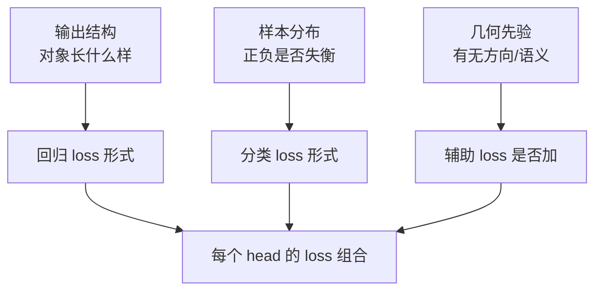

# LOSS 设计原理专题

> 一个面向初学者的学习专题，讲清楚多任务感知里"为什么不同任务的 loss 长得不一样"，以及每种 loss 的详细公式和设计动机。
>
> 本文以 `BevFusion`（`bevfusion_pointpillar_henet_multisensor_multitask_nuscenes.py`）和 MapTROE 车道线配置（`maptroe_henet_tinym_bevformer_nuscenes.py`）为案例。

---

## 目录

1. [一句话总结](#一句话总结)
2. [Loss 设计的三要素框架](#loss-设计的三要素框架)
3. [分类 Loss](#分类-loss)
4. [回归 Loss](#回归-loss)
5. [方向 Loss](#方向-loss)
6. [辅助 Loss](#辅助-loss)
7. [三头 Loss 对照总表](#三头-loss-对照总表)
8. [关键结论](#关键结论)

---

## 一句话总结

> 不同任务的 loss 之所以不同，**不是设计者随手挑的，而是「对象长什么样、正负样本多失衡、有没有方向等特殊性质」倒逼出来的**：
>
> - box 检测 → `FocalLoss`（分类）+ `L1Loss`（回归）
> - 车道线 → `FocalLoss` + `PtsL1Loss`（逐点回归）+ `PtsDirCosLoss`（方向）
> - 占用 → `CrossEntropyLoss`（逐体素分类）
>
> 用一个式子概括：**loss 设计 = f(输出结构, 样本分布, 几何先验)**。

---

## Loss 设计的三要素框架

每个任务的 loss 由三个问题共同决定：

| 决定因素 | 要回答的问题 | 映射到 loss 设计 |
|---|---|---|
| **输出结构** | 对象是 box / 折线 / 体素？ | L1Loss / PtsL1Loss / 无回归 |
| **样本分布** | 前景是否极端稀疏？ | FocalLoss（失衡）/ CE（均衡） |
| **几何先验** | 有没有方向、要不要密集辅助？ | PtsDirCosLoss、aux seg |



下面逐一展开每种 loss 的公式与原理。

---

## 分类 Loss

分类 loss 回答的是"这个对象/体素属于哪一类"。核心矛盾是**正负样本是否失衡**。

### 3.1 CrossEntropyLoss（交叉熵）

**公式**（多分类 softmax 形式）：

$$\text{CE}(p, y) = -\log p_t = -\sum_{c=0}^{C-1} y_c \log p_c$$

其中 $p_c$ 是模型对类别 $c$ 的预测概率，$y_c$ 是 one-hot 标签。等价地，$p_t$ 是模型对**真实类别**给出的概率。

**什么是 one-hot 标签**：one-hot（独热编码）是一种把"类别"表示成向量的方式——**只有真实类别对应的位置是 1，其余全是 0**。假设共 $C$ 个类别，某个样本的真实类别是第 $t$ 类，则它的标签向量是：

$$y = [\underbrace{0,\ 0,\ \dots,\ 0}_{不是真实类},\ \underbrace{1}_{第 t 类},\ \underbrace{0,\ \dots,\ 0}_{不是真实类}]$$

举例：占用预测有 18 类（`num_classes_occ=18`），某个体素的真实类别是 "car"（假设是第 4 类，索引从 0 起），则它的 one-hot 标签是一个长度 18 的向量：

```
索引:  0     1     2     3     4     5     ...   17
类别: others barrier bicycle bus car const_veh ... vegetation
标签: [ 0,    0,    0,     0,   1,    0,    ...    0  ]
                        ↑ 只有 car 位置是 1
```

因为只有 $y_t=1$、其余 $y_c=0$，交叉熵求和式 $\sum_c y_c \log p_c$ 里**只有真实类别那一项存活**，其余全被 $y_c=0$ 消掉，所以：

$$\sum_{c=0}^{C-1} y_c \log p_c = 1 \cdot \log p_t = \log p_t \quad\Rightarrow\quad \text{CE} = -\log p_t$$

这就是为什么交叉熵可以简写成"只关心真实类别的概率 $-\log p_t$"——one-hot 的稀疏性天然完成了"只挑出真实类别那一项"的筛选。

**特点**：
- 当 $p_t \to 1$（预测正确且置信度高）→ loss 趋近 0；
- 当 $p_t \to 0$（预测错误）→ loss 趋近 $\infty$。

**适用场景**：样本分布相对均衡的密集分类。占用预测（occ_head）就是典型——每个体素都要分到 18 类之一，不存在"几百个背景淹没几十个前景"的问题。

```python
occ_head = dict(
    type="BevformerOccDetDecoder",
    num_classes=18,
    loss_occ=dict(
        type="CrossEntropyLoss",
        use_sigmoid=False,
        ignore_index=255,   # 无效体素不参与
        loss_weight=6.0,
    ),
)
```

### 3.2 FocalLoss（焦点损失）

**为什么需要它**：集合预测（检测/车道线）里，query 数（900 / 50）远大于真实目标数（几十个），前景**极度稀疏**，且大量负样本（背景 query）**很容易分类**。直接交叉熵会被海量"易分负样本"的梯度淹没。

**公式**：

$$\text{FL}(p_t) = -\alpha_t (1-p_t)^\gamma \log p_t$$

其中：
- $p_t$：模型对真实类别的概率（若真类别为前景，$p_t=p$；若为背景，$p_t=1-p$）。
- $\gamma$（默认 `gamma=2.0`）：**调制因子**的指数，控制"易分样本降权"的强度。
- $\alpha_t$（默认 `alpha=0.25`）：类别平衡因子，给前景/背景不同的权重。

**核心机制**：$(1-p_t)^\gamma$ 让"已经分对"的样本贡献趋零：

| 样本类型 | $p_t$ | $(1-p_t)^\gamma$ | 效果 |
|---|---|---|---|
| 易分正样本 | → 1 | → 0 | 权重趋零，不再贡献 |
| 易分负样本 | → 1 | → 0 | 权重趋零，不再贡献 |
| 难分样本 | → 0 | → 1 | 权重保留，继续监督 |

**直觉**：FocalLoss = **"把注意力集中在难分样本上"的交叉熵**。$\gamma$ 越大，易分样本被压得越狠。

**适用场景**：前景稀疏 + 大量易分背景的集合预测，即检测（`bev_head`）和车道线（`lane_head`）。

```python
loss_cls=dict(
    type="FocalLoss",
    loss_name="cls",
    num_classes=num_classes + 1,   # 10 + 背景
    alpha=0.25,
    gamma=2.0,
    loss_weight=2.0,
    reduction="mean",
),
```

### 3.3 小结：CE vs FocalLoss

| 维度 | CrossEntropyLoss | FocalLoss |
|---|---|---|
| 公式 | $-\log p_t$ | $-\alpha_t(1-p_t)^\gamma\log p_t$ |
| 易分样本处理 | 照常贡献 loss | 被 $(1-p_t)^\gamma$ 降权 |
| 适用 | 样本均衡的密集分类 | 前景稀疏的集合预测 |
| 代表 | occ_head | bev_head / lane_head |

---

## 回归 Loss

回归 loss 回答的是"这个对象具体在哪儿 / 长什么样"。它的形式由**对象的几何表示**决定。

### 4.1 L1Loss（绝对误差）

**公式**：

$$\text{L1} = \left|\hat y - y\right|$$

**特点**：梯度恒为 $\pm 1$，对异常值（离群点）不敏感（不像 L2 那样被大误差平方放大），但零点处不可导。

**适用场景**：box 检测的几何回归，逐维比对 7~9 维参数（中心点 xyz、尺寸 wlh、朝向 yaw、速度 vx/vy）。

```python
loss_bbox=dict(
    type="L1Loss",
    loss_weight=0.25,
),
```

### 4.2 SmoothL1Loss（平滑 L1）

**为什么需要它**：L1 在零点处不可导（梯度跳变），L2 对离群点太敏感。SmoothL1 是两者的折中——小误差用 L2 平滑、大误差用 L1 抗离群。

**公式**（以 `beta` 为过渡阈值）：

$$\text{smoothL1}(x, \beta) =
\begin{cases}
\dfrac{0.5 x^2}{\beta} & |x| < \beta \\[6pt]
|x| - 0.5\beta & |x| \ge \beta
\end{cases}$$

- $|x| < \beta$：二次区（L2），梯度线性、零点平滑；
- $|x| \ge \beta$：线性区（L1），梯度恒定、抗离群。

**适用场景**：车道线逐点回归，`beta=0.01` 表示"点坐标误差小于 1cm 时用 L2 平滑，否则用 L1"。

### 4.3 PtsL1Loss（折线点回归）

**公式**：一条车道线 = 20 个有序 2D 点，逐点对齐后求 smoothL1 之和：

$$\text{PtsL1} = \sum_{k=0}^{19} \text{smoothL1}\left(\hat p_i[k] - p_j[k],\ \beta\right)$$

其中 $\hat p_i[k]$、$p_j[k]$ 分别是预测和 GT 的第 $k$ 个点（每个点 2 维），共 $20\times2=40$ 个标量。

```python
loss_pts=dict(type="PtsL1Loss", loss_weight=2.5, beta=0.01),
```

**和 L1Loss 的区别**：L1Loss 是对一个"框"的固定维度逐维回归；PtsL1Loss 是对一条"线"的**逐点有序**回归。前者对象是 box，后者对象是折线——这是"输出结构决定回归 loss"的直接体现。

### 4.4 代价矩阵里的"Cost"不是"Loss"

注意区分：`BBox3DL1Cost` 和 `OrderedPtsL1Cost` 是**匈牙利匹配的代价**（用于配对），不是训练 loss。但它们的公式和 L1Loss/PtsL1Loss 一致，只是用途不同（一个是"分配"，一个是"监督"）。详见《DETR Query 原理专题》第 7 节。

---

## 方向 Loss

### PtsDirCosLoss（折线方向余弦损失）

**为什么需要它**：`PtsL1Loss` 只约束"点位置对不对"，**约束不了线的方向**。一条线正着画、反着画，20 个点的位置集合可能都对，但顺序是反的。只有点有序（Ordered），方向才可定义、可监督。

**公式**：用相邻点的差分向量定义方向，约束预测方向与 GT 方向一致：

$$\text{DirCos} = \frac{1}{N-1}\sum_{k=0}^{N-2}\left(1 - \frac{(\hat p_{k+1}-\hat p_k)\cdot(p_{k+1}-p_k)}{\|\hat p_{k+1}-\hat p_k\|\ \|p_{k+1}-p_k\|}\right)$$

其中 $\hat p_{k+1}-\hat p_k$ 是预测折线第 $k$ 段的**方向向量**，分母是两个向量范数乘积（归一化），中间是**余弦相似度**。

- 方向一致 → 余弦 → 1 → loss → 0；
- 方向相反 → 余弦 → -1 → loss → 2（最大惩罚）。

```python
loss_dir=dict(type="PtsDirCosLoss", loss_weight=0.005),
```

**权重为什么很小（0.005）**：方向是"锦上添花"的弱约束，主约束还是点位置（`PtsL1Loss` 权重 2.5）。方向 loss 只需轻轻拉住，避免方向倒转即可。

**为什么 box 检测没有方向 loss**：box 的朝向 `yaw` 已经作为回归变量之一被 `L1Loss` 直接监督了，方向信息编码在 box 参数里，不需要单独的余弦约束——这也是"输出结构决定 loss"的又一体现。

---

## 辅助 Loss

### SimpleLoss（带正样本权重的二分类交叉熵）

车道线配置里还有 `loss_seg` 和 `loss_pv_seg`，用于**辅助监督（auxiliary segmentation）**：BEV 分割 / 透视分割，提供密集的、逐像素的监督信号，帮助 backbone 学到更好的语义特征，间接提升折线回归。

**公式**（二分类 BCE + 正样本权重）：

$$\text{SimpleLoss} = -w_p\, y\log p - (1-y)\log(1-p)$$

其中 $w_p$ 是**正样本权重**（`pos_weight`），用于应对分割里"前景（线）远少于背景"的失衡。

```python
loss_seg=dict(type="SimpleLoss", pos_weight=4.0, loss_weight=1.0),   # BEV 分割，线更稀疏，权重更大
loss_pv_seg=dict(type="SimpleLoss", pos_weight=1.0, loss_weight=2.0), # 透视分割
```

**为什么车道线需要辅助 seg，而检测/占用不需要**：
- 车道线是**长而细的稀疏结构**，纯折线回归的监督信号太稀疏，难收敛；
- 密集分割能提供"哪些地方有线"的逐像素强监督，是天然的辅助信号；
- 检测（box）和占用（体素）本身就是密集监督，不需要额外辅助。

> 注意：辅助 loss 只在训练时用（`aux_seg` 的 `use_aux_seg=True`），部署时关闭（`deploy_model` 里 `aux_seg` 全设为 False），因为它不是推理必需输出。

---

## 三头 Loss 对照总表

| 维度 | bev_head（box 检测） | lane_head（车道线） | occ_head（占用） |
|---|---|---|---|
| 预测范式 | 集合预测 | 集合预测 | 密集预测 |
| 分类 loss | FocalLoss | FocalLoss | CrossEntropyLoss |
| 回归 loss | L1Loss（box 7~9 维） | PtsL1Loss（20 点） | 无 |
| 方向 loss | 无（yaw 在 box 里） | PtsDirCosLoss | 无 |
| 辅助 loss | 无 | SimpleLoss（BEV/PV seg） | 无 |
| 匹配 | 匈牙利（BBox3DL1Cost） | 匈牙利（OrderedPtsL1Cost） | 无（逐体素对应） |
| 无效样本处理 | 匹配到背景 ∅ | 匹配到背景 ∅ | ignore_index=255 + mask |

---

## 关键结论

1. **回归 loss 的形式 = 对象几何的表示形式**：box 用 L1，折线用逐点有序 L1，体素无回归。
2. **分类 loss 的选择 = 正负样本是否极端失衡**：失衡 → FocalLoss（$(1-p_t)^\gamma$ 压制易分样本）；均衡 → CE。
3. **辅助 loss = 主 loss 无法约束的先验的补充**：折线有方向 → 加 DirCos；折线稀疏难收敛 → 加分割辅助。
4. **密集 vs 集合 = loss 的分配方式**：集合预测先匈牙利匹配再稀疏算 loss，密集预测逐格/逐体素算 loss。
5. **代价（Cost）≠ 损失（Loss）**：Cost 用于匈牙利配对（分配），Loss 用于反向传播（监督），公式同源但用途不同。

---

*本文基于 `bevfusion_pointpillar_henet_multisensor_multitask_nuscenes.py`（BevFusion 多任务配置）与 `maptroe_henet_tinym_bevformer_nuscenes.py`（MapTROE 车道线配置）整理，与《DETR Query 原理专题》配套阅读。*
