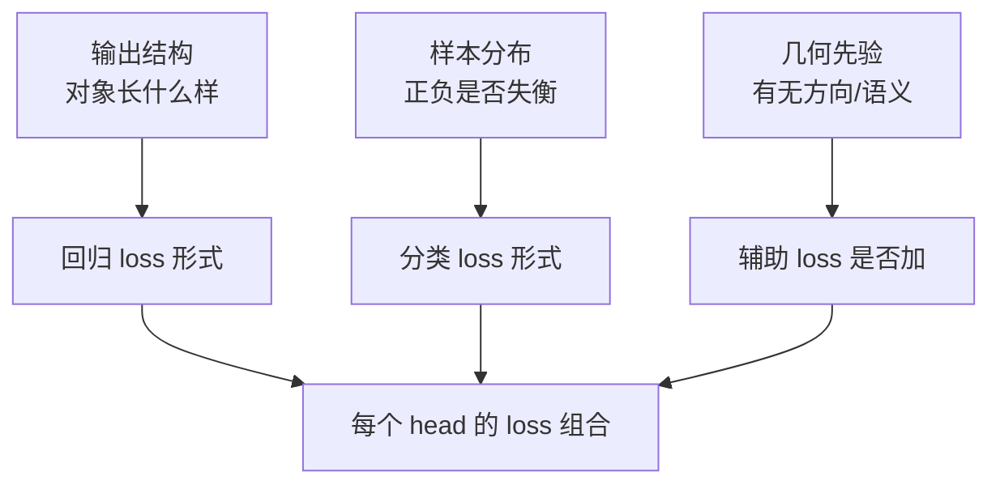
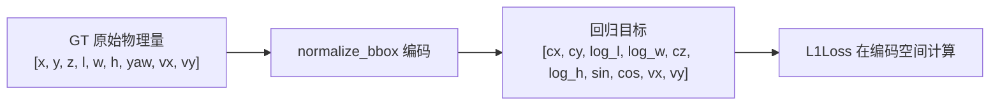

# LOSS 设计原理专题

> 一个面向初学者的学习专题，讲清楚多任务感知里"为什么不同任务的 loss 长得不一样"，以及每种 loss 的详细公式和设计动机。
>
> 本文以 `BevFusion`（`bevfusion_pointpillar_henet_multisensor_multitask_nuscenes.py`）和 MapTROE 车道线配置（`maptroe_henet_tinym_bevformer_nuscenes.py`）为案例。

---

## 目录

1. [一句话总结](#一句话总结)
2. [Loss 设计的三要素框架](#loss-设计的三要素框架)
3. [分类 Loss](#分类-loss)
4. [回归 Loss](#回归-loss)
5. [方向 Loss](#方向-loss)
6. [辅助 Loss](#辅助-loss)
7. [三头 Loss 对照总表](#三头-loss-对照总表)
8. [关键结论](#关键结论)

---

## 一句话总结

> 不同任务的 loss 之所以不同，**不是设计者随手挑的，而是「对象长什么样、正负样本多失衡、有没有方向等特殊性质」倒逼出来的**：
>
> - box 检测 → `FocalLoss`（分类）+ `L1Loss`（回归）
> - 车道线 → `FocalLoss` + `PtsL1Loss`（逐点回归）+ `PtsDirCosLoss`（方向）
> - 占用 → `CrossEntropyLoss`（逐体素分类）
>
> 用一个式子概括：**loss 设计 = f(输出结构, 样本分布, 几何先验)**。

---

## Loss 设计的三要素框架

每个任务的 loss 由三个问题共同决定：

| 决定因素 | 要回答的问题 | 映射到 loss 设计 |
|---|---|---|
| **输出结构** | 对象是 box / 折线 / 体素？ | L1Loss / PtsL1Loss / 无回归 |
| **样本分布** | 前景是否极端稀疏？ | FocalLoss（失衡）/ CE（均衡） |
| **几何先验** | 有没有方向、要不要密集辅助？ | PtsDirCosLoss、aux seg |



下面逐一展开每种 loss 的公式与原理。

---

## 分类 Loss

分类 loss 回答的是"这个对象/体素属于哪一类"。核心矛盾是**正负样本是否失衡**。

### 3.1 CrossEntropyLoss（交叉熵）

**公式**（多分类 softmax 形式）：

$$\text{CE}(p, y) = -\log p_t = -\sum_{c=0}^{C-1} y_c \log p_c$$

其中 $p_c$ 是模型对类别 $c$ 的预测概率，$y_c$ 是 one-hot 标签。等价地，$p_t$ 是模型对**真实类别**给出的概率。

**什么是 one-hot 标签**：one-hot（独热编码）是一种把"类别"表示成向量的方式——**只有真实类别对应的位置是 1，其余全是 0**。假设共 $C$ 个类别，某个样本的真实类别是第 $t$ 类，则它的标签向量是：

$$y = [\underbrace{0,\ 0,\ \dots,\ 0}_{不是真实类},\ \underbrace{1}_{第 t 类},\ \underbrace{0,\ \dots,\ 0}_{不是真实类}]$$

举例：占用预测有 18 类（`num_classes_occ=18`），某个体素的真实类别是 "car"（假设是第 4 类，索引从 0 起），则它的 one-hot 标签是一个长度 18 的向量：

```
索引:  0     1     2     3     4     5     ...   17
类别: others barrier bicycle bus car const_veh ... vegetation
标签: [ 0,    0,    0,     0,   1,    0,    ...    0  ]
                        ↑ 只有 car 位置是 1
```

因为只有 $y_t=1$、其余 $y_c=0$，交叉熵求和式 $\sum_c y_c \log p_c$ 里**只有真实类别那一项存活**，其余全被 $y_c=0$ 消掉，所以：

$$\sum_{c=0}^{C-1} y_c \log p_c = 1 \cdot \log p_t = \log p_t \quad\Rightarrow\quad \text{CE} = -\log p_t$$

这就是为什么交叉熵可以简写成"只关心真实类别的概率 $-\log p_t$"——one-hot 的稀疏性天然完成了"只挑出真实类别那一项"的筛选。

**特点**：
- 当 $p_t \to 1$（预测正确且置信度高）→ loss 趋近 0；
- 当 $p_t \to 0$（预测错误）→ loss 趋近 $\infty$。

**适用场景**：样本分布相对均衡的密集分类。占用预测（occ_head）就是典型——每个体素都要分到 18 类之一，不存在"几百个背景淹没几十个前景"的问题。

```python
occ_head = dict(
    type="BevformerOccDetDecoder",
    num_classes=18,
    loss_occ=dict(
        type="CrossEntropyLoss",
        use_sigmoid=False,
        ignore_index=255,   # 无效体素不参与
        loss_weight=6.0,
    ),
)
```

### 3.2 FocalLoss（焦点损失）

**为什么需要它**：集合预测（检测/车道线）里，query 数（900 / 50）远大于真实目标数（几十个），前景**极度稀疏**，且大量负样本（背景 query）**很容易分类**。直接交叉熵会被海量"易分负样本"的梯度淹没。

**公式**：

$$\text{FL}(p_t) = -\alpha_t (1-p_t)^\gamma \log p_t$$

其中：
- $p_t$：模型对真实类别的概率（若真类别为前景，$p_t=p$；若为背景，$p_t=1-p$）。
- $\gamma$（默认 `gamma=2.0`）：**调制因子**的指数，控制"易分样本降权"的强度。
- $\alpha_t$（默认 `alpha=0.25`）：类别平衡因子，给前景/背景不同的权重。

**核心机制**：$(1-p_t)^\gamma$ 让"已经分对"的样本贡献趋零：

| 样本类型 | $p_t$ | $(1-p_t)^\gamma$ | 效果 |
|---|---|---|---|
| 易分正样本 | → 1 | → 0 | 权重趋零，不再贡献 |
| 易分负样本 | → 1 | → 0 | 权重趋零，不再贡献 |
| 难分样本 | → 0 | → 1 | 权重保留，继续监督 |

**直觉**：FocalLoss = **"把注意力集中在难分样本上"的交叉熵**。$\gamma$ 越大，易分样本被压得越狠。

**适用场景**：前景稀疏 + 大量易分背景的集合预测，即检测（`bev_head`）和车道线（`lane_head`）。

```python
loss_cls=dict(
    type="FocalLoss",
    loss_name="cls",
    num_classes=num_classes + 1,   # 10 + 背景
    alpha=0.25,
    gamma=2.0,
    loss_weight=2.0,
    reduction="mean",
),
```

#### FocalLoss 的实现 trick：per-class sigmoid（无独立背景类）

看 `hat/models/losses/focal_loss.py` 的实际实现，有一个**教科书公式里容易误解的关键点**：

```python
pred = pred.float().sigmoid()               # N x C，C = 前景类别数，无独立背景通道
target[target < 0] = self.num_classes - 1   # 背景 label 映射到第 C 类（仅用于 one-hot 的维度对齐）
one_hot = F.one_hot(target, self.num_classes)  # N x (C+1)
one_hot = one_hot[..., : self.num_classes - 1] # N x C —— 剥掉的是"背景类别通道"，不是"背景样本"
pt = torch.where(torch.eq(one_hot, 1), pred, 1 - pred)
```

**关键理解**：这是 **sigmoid focal loss**，本质是 **C 个独立的二分类**（"是不是 car？""是不是 pedestrian？"……），而不是 (C+1)-way 的 softmax 竞争。所以：

> **什么是 "softmax 竞争" vs "sigmoid 二分类"**：
>
> 先解释 **"K-way"** 这个习惯用语：它在分类语境里表示"分类器**有 K 个输出类别/出口**"。例如 "10-way classification" = 十分类，"2-way" = 二分类。所以 **"(C+1)-way" = "C+1 分类"**，即把 C 个前景类 + 1 个背景类放在一起做分类。它强调的不是"算法怎么算"，而是"输出端有多少个类别在参与决策"。
>
> - **softmax（多分类竞争）**：把 C+1 个类别（含背景）的输出做归一化，让它们**总和 = 1、彼此互斥**——每个样本必须"且只能"属于一个类。这是 `occ_head` 的 `CrossEntropyLoss`（`use_sigmoid=False`）做的事，它天然需要一个独立的"背景类"通道来和其他类竞争。
> - **sigmoid（独立二分类）**：每个类别**独立**判断"我是不是这一类"，互不干扰、不归一化到 1。一个样本理论上可以同时是多个类（多标签），也不需要独立的背景通道——"背景"就是"所有类都不是"。检测/车道线的 `FocalLoss` 走的是这条路，所以 `pred` 是 N×C（只有 C 个前景类，没有背景位）。
>
> 两者对"背景"的处理方式完全不同：softmax 需要显式背景类参与竞争；sigmoid 则让背景隐式地由"所有前景类都输出低分"来表达。这决定了后面的"背景通道被剥掉"其实是 sigmoid 的天然属性，而不是一个额外的操作。

- `pred` 是 N×C，**没有独立的背景通道**；`num_classes = C + 1` 多出的那一位只是为了让 `F.one_hot` 的维度对齐（背景 label 能映射到第 C 位），随后立刻被切片 `[..., :C]` 剥掉。
- **被剥掉的是"背景这个类别通道"，不是"背景样本"**。背景 query（`one_hot` 全 0）**仍然参与 focal loss**，形式是"所有 C 个前景类都输出低分"：

$$\text{loss}_{bg} = -(1-\alpha)\cdot (1-p_t)^\gamma\cdot \log(1-p_t)\quad\text{（对每个前景类，}p_t = p\text{）}$$

即背景样本的 loss 来自 **sigmoid 的负样本项 $\log(1-p)$**，它希望每个前景类的概率 $p$ 都尽量小。

**两个重要澄清**：
1. **背景没有"交给 label_weights 单独压制"**。源码里 `label_weights = gt_bboxes.new_ones(num_bboxes)`，前景和背景的 weight **都是 1**，都参与分类 loss。区分前景/背景靠的是 `one_hot` 里有没有 1，而不是 weight。
2. **focal 对背景依然有效**：背景样本数量压倒性（900 query 里匹配到 GT 的只有几十个），且大多是"易分负样本"（$p$ 很小，$(1-p_t)^\gamma\to 0$），**γ 正是用来压制这些海量易分背景的**。

**所以"背景剥离"和"有必要用 focal"并不矛盾**：剥离的只是背景的**显式类别通道**（因为 sigmoid 是 per-class 二分类，本来就不需要独立的背景类），而背景样本的压倒性数量和易分性**原封不动**，focal 的 $\gamma$ 和 $\alpha$ 正是为它而设。

> 一句话：这里不是"背景被剥离、交给 label_weights"，而是 **sigmoid focal 天然没有独立背景类**——背景样本仍以"所有前景类低分"的形式留在 loss 里，靠 $\alpha(1-\alpha)$ 和 $\gamma$ 调节，这才是 focal loss 在此处不可替代的原因。

### 3.3 小结：CE vs FocalLoss

| 维度 | CrossEntropyLoss | FocalLoss |
|---|---|---|
| 公式 | $-\log p_t$ | $-\alpha_t(1-p_t)^\gamma\log p_t$ |
| 易分样本处理 | 照常贡献 loss | 被 $(1-p_t)^\gamma$ 降权 |
| 适用 | 样本均衡的密集分类 | 前景稀疏的集合预测 |
| 代表 | occ_head | bev_head / lane_head |

---

## 回归 Loss

回归 loss 回答的是"这个对象具体在哪儿 / 长什么样"。它的形式由**对象的几何表示**决定。

### 4.1 L1Loss（绝对误差）

**公式**：

$$\text{L1} = \left|\hat y - y\right|$$

**特点**：梯度恒为 $\pm 1$，对异常值（离群点）不敏感（不像 L2 那样被大误差平方放大），但零点处不可导。

**适用场景**：box 检测的几何回归，逐维比对 7~9 维参数（中心点 xyz、尺寸 wlh、朝向 yaw、速度 vx/vy）。

```python
loss_bbox=dict(
    type="L1Loss",
    loss_weight=0.25,
),
```

### 4.2 SmoothL1Loss（平滑 L1）

**为什么需要它**：L1 在零点处不可导（梯度跳变），L2 对离群点太敏感。SmoothL1 是两者的折中——小误差用 L2 平滑、大误差用 L1 抗离群。

**公式**（以 `beta` 为过渡阈值）：

$$\text{smoothL1}(x, \beta) =
\begin{cases}
\dfrac{0.5 x^2}{\beta} & |x| < \beta \\[6pt]
|x| - 0.5\beta & |x| \ge \beta
\end{cases}$$

- $|x| < \beta$：二次区（L2），梯度线性、零点平滑；
- $|x| \ge \beta$：线性区（L1），梯度恒定、抗离群。

**适用场景**：车道线逐点回归，`beta=0.01` 表示"点坐标误差小于 1cm 时用 L2 平滑，否则用 L1"。

### 4.3 PtsL1Loss（折线点回归）

**公式**：一条车道线 = 20 个有序 2D 点，逐点对齐后求 smoothL1 之和：

$$\text{PtsL1} = \sum_{k=0}^{19} \text{smoothL1}\left(\hat p_i[k] - p_j[k],\ \beta\right)$$

其中 $\hat p_i[k]$、$p_j[k]$ 分别是预测和 GT 的第 $k$ 个点（每个点 2 维），共 $20\times2=40$ 个标量。

```python
loss_pts=dict(type="PtsL1Loss", loss_weight=2.5, beta=0.01),
```

**和 L1Loss 的区别**：L1Loss 是对一个"框"的固定维度逐维回归；PtsL1Loss 是对一条"线"的**逐点有序**回归。前者对象是 box，后者对象是折线——这是"输出结构决定回归 loss"的直接体现。

### 4.4 代价矩阵里的"Cost"不是"Loss"

注意区分：`BBox3DL1Cost` 和 `OrderedPtsL1Cost` 是**匈牙利匹配的代价**（用于配对），不是训练 loss。但它们的公式和 L1Loss/PtsL1Loss 一致，只是用途不同（一个是"分配"，一个是"监督"）。详见《DETR Query 原理专题》第 7 节。

### 4.5 bbox 的回归编码：`normalize_bbox`（尺寸 log、朝向 sin/cos）

前面 4.1 说"L1Loss 对 box 的 7~9 维逐维回归"，但**网络回归的不是原始物理量**，而是先经过一层**编码（normalize_bbox）**。这层编码决定了 L1 实际度量的是什么。以 `BevFormerCriterion`（`bev_head`）为例，它的 GT 在算 loss 之前会被编码：



#### 正变换 `normalize_bbox`（训练/匹配端）

GT box 布局为 `[x, y, z, l, w, h, yaw, vx, vy]`，编码规则如下：

| 原始分量 | 编码方式 | 为什么 |
|---|---|---|
| 中心 `cx, cy, cz` | **线性**（原样保留） | 中心是平移量，动态范围已被场景范围限制 |
| 尺寸 `l, w, h` | **`.log()`** | 尺寸跨度两个数量级，log 把"绝对误差"变成"相对误差" |
| 朝向 `yaw` | **`(sin(yaw), cos(yaw))`** | yaw 有周期性（-π 和 π 是同一个角），直接回归会在 ±π 处产生不连续跳变 |
| 速度 `vx, vy` | **线性**（原样保留） | 速度范围相对集中 |

核心代码（`hat/models/task_modules/bevformer/utils.py`）：

```python
def normalize_bbox(bboxes):
    cx  = bboxes[..., 0:1]          # 中心 x  —— 线性
    cy  = bboxes[..., 1:2]          # 中心 y  —— 线性
    cz  = bboxes[..., 2:3]          # 中心 z  —— 线性
    w   = bboxes[..., 3:4].log()    # 尺寸 l  —— log
    bl  = bboxes[..., 4:5].log()    # 尺寸 w  —— log
    h   = bboxes[..., 5:6].log()    # 尺寸 h  —— log
    rot = bboxes[..., 6:7]          # 朝向 yaw —— sin/cos
    # 输出顺序（BEVFormer 历史格式，注意 cz 被挪到第 5 位）
    return torch.cat((cx, cy, w, bl, cz, h, rot.sin(), rot.cos(), vx, vy), -1)
```

> ⚠️ **两个易混淆点**：
> 1. 变量命名 `w` 实际取的是 GT 第 3 维（长度 `l`），`bl` 取第 4 维（宽度 `w`）——是 BEVFormer 官方历史命名，别被误导。
> 2. 输出顺序是 `[cx, cy, log_l, log_w, cz, log_h, sin, cos, vx, vy]`，**`cz` 被挪到了第 5 位**（不是紧跟 cy），这是 BEVFormer 的格式遗留。

#### 反变换 `denormalize_bbox`（推理后处理端）

推理时网络输出的是编码空间的预测值，`BevFormerProcess` 后处理会反变换回物理量：

```python
w  = normalized[..., 2:3].exp()    # log → exp 还原尺寸
bl = normalized[..., 3:4].exp()
h  = normalized[..., 5:6].exp()
rot = torch.atan2(sin, cos)        # sin/cos → atan2 还原朝向
# 输出回到 [x, y, z, l, w, h, yaw, vx, vy]
```

#### 三个调用点，保证"编解码一致"

编码必须**在算 loss / 匹配之前**统一作用，解码在**推理之后**统一还原，三处一致才不会错位：

| 调用点 | 位置 | 作用 |
|---|---|---|
| 匈牙利匹配 | `assigner.py` | `normalize_bbox(gt_bboxes)`，代价矩阵在**编码空间**算 |
| 算 loss | `criterion.py` | `normalize_bbox(bbox_targets)`，L1 在**编码空间**算 |
| 推理后处理 | `postprocess.py` | `denormalize_bbox(bbox_preds)`，`exp`/`atan2` 还原 |

#### 为什么这决定了 L1 的真实含义

因为尺寸先 `log` 再算 L1，所以：

$$\text{L1}_{log} = \left|\log \hat l - \log l\right| = \left|\log\frac{\hat l}{l}\right| \approx \left|\frac{\hat l - l}{l}\right|$$

即 **L1 实际度量的是尺寸的相对误差**，大目标（卡车）和小目标（锥桶）在统一的误差尺度下被监督。朝向用 sin/cos 则避免了 yaw 在 ±π 处的不连续，让 L1 能平滑监督角度。

---

## 方向 Loss

### PtsDirCosLoss（折线方向余弦损失）

**为什么需要它**：`PtsL1Loss` 只约束"点位置对不对"，**约束不了线的方向**。一条线正着画、反着画，20 个点的位置集合可能都对，但顺序是反的。只有点有序（Ordered），方向才可定义、可监督。

**公式**：用相邻点的差分向量定义方向，约束预测方向与 GT 方向一致：

$$\text{DirCos} = \frac{1}{N-1}\sum_{k=0}^{N-2}\left(1 - \frac{(\hat p_{k+1}-\hat p_k)\cdot(p_{k+1}-p_k)}{\|\hat p_{k+1}-\hat p_k\|\ \|p_{k+1}-p_k\|}\right)$$

其中 $\hat p_{k+1}-\hat p_k$ 是预测折线第 $k$ 段的**方向向量**，分母是两个向量范数乘积（归一化），中间是**余弦相似度**。

- 方向一致 → 余弦 → 1 → loss → 0；
- 方向相反 → 余弦 → -1 → loss → 2（最大惩罚）。

```python
loss_dir=dict(type="PtsDirCosLoss", loss_weight=0.005),
```

**权重为什么很小（0.005）**：方向是"锦上添花"的弱约束，主约束还是点位置（`PtsL1Loss` 权重 2.5）。方向 loss 只需轻轻拉住，避免方向倒转即可。

**为什么 box 检测没有方向 loss**：box 的朝向 `yaw` 已经作为回归变量之一被 `L1Loss` 直接监督了，方向信息编码在 box 参数里，不需要单独的余弦约束——这也是"输出结构决定 loss"的又一体现。

#### 实现细节：CosineEmbeddingLoss + dir_interval + 物理空间算方向

看 `hat/models/task_modules/maptr/criterion.py`，方向 loss 有三个文档公式没体现的实现细节：

**1. 底层借用了 `CosineEmbeddingLoss`**

```python
loss_func = torch.nn.CosineEmbeddingLoss(reduction="none")
tgt_param = target.new_ones((num_samples, num_dir))   # 全 1 = "应该相似"
loss = loss_func(pred.flatten(0, 1), target.flatten(0, 1), tgt_param)
```

`CosineEmbeddingLoss(y=1)` 的公式是 $\max(0,\ 1-\cos\theta)$，数值上等价于上面的 $1-\cos$，所以公式没变，只是实现借用了现成 API（比手写余弦更省事、更不易出错）。

**2. `dir_interval`：方向向量是"间隔 k 个点"的差分**

```python
dir_weights = pts_weights[:, : -self.dir_interval, 0]
denormed_pts_preds_dir = (
    denormed_pts_preds[:, self.dir_interval:, :]     # 后段
    - denormed_pts_preds[:, :-self.dir_interval, :]  # 前段
)
```

方向向量不是严格的"相邻点差分"（点 k+1 − 点 k），而是"间隔 `dir_interval` 个点的差分"（点 k+d − 点 k）。你的配置 `dir_interval=1` 时才是相邻点。

**好处**：车道线采样点很密（20 个点），相邻点之间距离极短，方向向量噪声大、数值不稳定；用间隔 d 个点的差分，方向向量更长、更稳定，对噪声更鲁棒。`dir_interval` 就是"隔几个点取方向"的旋钮。

**3. 方向 loss 在"反归一化后的物理空间"算**

```python
denormed_pts_preds = denormalize_2d_pts(pts_preds, self.pc_range)  # 先还原物理坐标
denormed_pts_preds_dir = denormed_pts_preds[:, d:, :] - denormed_pts_preds[:, :-d, :]
```

点坐标在归一化时 x/y 被分别缩放到 $[0,1]$（各轴缩放因子可能不同），会**扭曲方向角**（各向异性缩放不保角）。所以在物理空间算方向差分，方向角才准确。

**好处**：保证 `PtsDirCosLoss` 度量的是真实的方向偏差，而不是被归一化畸变污染的角度。

### num_orders：车道线的双向匹配（方向对称性）

这是车道线检测里**最重要、最容易被忽略的 trick**，藏在 `OrderedPtsL1Cost` 里：

```python
num_gts, num_orders, num_pts, num_coords = gt_bboxes.shape
gt_bboxes = gt_bboxes.flatten(2).view(num_gts * num_orders, -1)  # 展开正反两个方向
bbox_cost = torch.cdist(bbox_pred, gt_bboxes, p=1)
```

GT 折线被存成 `num_orders` 个方向（通常是**正序 + 反序**两个版本）。匹配时把两个方向都展开，与预测折线算 L1 距离后，**取代价最小的那个方向**。

**为什么必须这样**：车道线**没有固定的"起点 → 终点"**。同一条线，从 A 端标到 B 端、或从 B 端标到 A 端，物理上是**同一条线**。如果只按一个方向匹配，模型会被"方向标签"误导——明明预测对了，只因起点方向相反就被误判为错。

**好处**：
1. **消除方向歧义**：匹配时对"正反两个方向"都试，取最小代价，模型不再被起点方向束缚，只需学"线在哪、长什么样"。
2. **`Ordered` 与 `num_orders` 不矛盾**：`Ordered` 指的是"点序对齐后逐个比较"（点 0↔点 0、点 1↔点 1，保证方向监督有效）；而 `num_orders` 解决的是"整体起点可以翻转"这个更高层的对称性。两者配合，既保留了有序点监督，又不惩罚起点方向倒置。
3. **配合 `loss_dir` 才有意义**：正因为匹配阶段已经消除了起点歧义，`PtsDirCosLoss` 监督的方向才是"确定的、无歧义的"方向，不会和双向匹配打架。

> 一句话：**`num_orders` 把"一条线两种标法"统一成"同一条线"，是车道线匹配阶段消除方向歧义的关键**；没有它，`Ordered` 匹配 + `PtsDirCosLoss` 都会被错误的起点方向干扰。

---

## 辅助 Loss

### SimpleLoss（带正样本权重的二分类交叉熵）

车道线配置里还有 `loss_seg` 和 `loss_pv_seg`，用于**辅助监督（auxiliary segmentation）**：BEV 分割 / 透视分割，提供密集的、逐像素的监督信号，帮助 backbone 学到更好的语义特征，间接提升折线回归。

**公式**（二分类 BCE + 正样本权重）：

$$\text{SimpleLoss} = -w_p\, y\log p - (1-y)\log(1-p)$$

其中 $w_p$ 是**正样本权重**（`pos_weight`），用于应对分割里"前景（线）远少于背景"的失衡。

```python
loss_seg=dict(type="SimpleLoss", pos_weight=4.0, loss_weight=1.0),   # BEV 分割，线更稀疏，权重更大
loss_pv_seg=dict(type="SimpleLoss", pos_weight=1.0, loss_weight=2.0), # 透视分割
```

**为什么车道线需要辅助 seg，而检测/占用不需要**：
- 车道线是**长而细的稀疏结构**，纯折线回归的监督信号太稀疏，难收敛；
- 密集分割能提供"哪些地方有线"的逐像素强监督，是天然的辅助信号；
- 检测（box）和占用（体素）本身就是密集监督，不需要额外辅助。

> 注意：辅助 loss 只在训练时用（`aux_seg` 的 `use_aux_seg=True`），部署时关闭（`deploy_model` 里 `aux_seg` 全设为 False），因为它不是推理必需输出。

---

## 三头 Loss 对照总表

| 维度 | bev_head（box 检测） | lane_head（车道线） | occ_head（占用） |
|---|---|---|---|
| 预测范式 | 集合预测 | 集合预测 | 密集预测 |
| 分类 loss | FocalLoss | FocalLoss | CrossEntropyLoss |
| 回归 loss | L1Loss（box 7~9 维） | PtsL1Loss（20 点） | 无 |
| 方向 loss | 无（yaw 在 box 里） | PtsDirCosLoss | 无 |
| 辅助 loss | 无 | SimpleLoss（BEV/PV seg） | 无 |
| 匹配 | 匈牙利（BBox3DL1Cost） | 匈牙利（OrderedPtsL1Cost） | 无（逐体素对应） |
| 无效样本处理 | 匹配到背景 ∅ | 匹配到背景 ∅ | ignore_index=255 + mask |

---

## 关键结论

1. **回归 loss 的形式 = 对象几何的表示形式**：box 用 L1，折线用逐点有序 L1，体素无回归。
2. **分类 loss 的选择 = 正负样本是否极端失衡**：失衡 → FocalLoss（$(1-p_t)^\gamma$ 压制易分样本）；均衡 → CE。
3. **辅助 loss = 主 loss 无法约束的先验的补充**：折线有方向 → 加 DirCos；折线稀疏难收敛 → 加分割辅助。
4. **密集 vs 集合 = loss 的分配方式**：集合预测先匈牙利匹配再稀疏算 loss，密集预测逐格/逐体素算 loss。
5. **代价（Cost）≠ 损失（Loss）**：Cost 用于匈牙利配对（分配），Loss 用于反向传播（监督），公式同源但用途不同。

---

*本文基于 `bevfusion_pointpillar_henet_multisensor_multitask_nuscenes.py`（BevFusion 多任务配置）与 `maptroe_henet_tinym_bevformer_nuscenes.py`（MapTROE 车道线配置）整理，与《DETR Query 原理专题》配套阅读。*
